# <h1>Plassy</h1>

 

 

## <h1>Table of Contents</h1>

 

- [Plassy](#plassy)
- [Introduction](#introduction)
  + [Who am I?](#who-am-i)
  + [Why the Plassy?](#why-the-plassy)
- [Goals](#goals)
  + [Personal Goals](#personal-goals)
  + [Visitor Goals](#visitor-goals)
- [Design and Planning](#design-and-planning)
  + [Color](#color)
  + [Fonts](#fonts)
  + [Structure](#structure)
  + [Features](#features)
  + [Wireframes](#wireframes)
  + [Languages and Technologies](#languages-and-technologies)
- [Testing](#testing)
  + [Accessibility](#accessibility)
  + [Performance](#performance)
  + [Validation](#validation)
  + [Reponsiveness](#responsiveness)
- [User Story Testing](#user-story-testing)
- [Acknowledgements](#acknowledgements)
- [Credits](#credits)

 
 

## <h1>Introduction</h1> 

### <h2>Who am I?</h2> 

My name is Brían ó Cualáin and I am a native of Inisheer which is the smallest of the Aran Islands archipelago off the west coast of Ireland although I have been living in Ireland for the last 30 years. ( We islanders refer to the mainland as Ireland in the same way someone might refer to it as another country which culturally and linguistically if not indeed physically it almost certainly is. 😉) Inisheer's population has remained around the 300 mark since I grew up there and it continues to be an ever more popular tourist destination endowned as it is by both natural and manmade beauty and its location beside the world renowned Cliffs of Moher, Doolin, Lahinch and the Aran Islands themselves.

### <h2>Why the Plassy?</h2> 

My father Máirtín ó Cualáin (Martin Folan) was a member of the onshore rescue unit and took part in the rescue of the Plassy crew. I myself have been fascinated with the Plassy since I was a child. It was a favouite spot in which to play hide and seek or just to explore from the time I first managed to climb up into it, itself a rite of passage of sorts when growing up on Inisheer. One of my scariest and proudest moments was walking accross the 4m iron girder in the engine room in order to climb down there to explore the dark recesses of the ship. The girder was barely 10cm wide and there was a drop of about 4m to the engine room floor which was strewn with debris and rusting metal, hence the mix of fear and pride. Of course it goes withouot saying that I wouldn't encourage anyone to do such a thing today and in fact it is even more dangerous than ever now given the state of corrosion of the plassy and the advanced structural damage caused over time by the incessant pounding of Atlantic storms.

 
 

## <h1>Goals</h1> 

### <h2>Personal Goals</h2>

 

- Record knowledge of the subject
- Add to knowledge of the subject
- Learn to create attractive web pages
- Build a portfolio of webpages
- Gain employment or create a solo web development business

Its my intention to add further to the Plassy in terms of information and enhancement and to broaden its scope to related maritime and historical topics. Future enhancement may also include relevant accomodation and travel information for the visitor. 

 

### <h2>Visitor Goals</h2>

 

 - Learn about the Plassy
 - Learn about shipbuilding
 - Discover its fascinating history
 - Appreciate the human aspect
 - Add visiting the Plassy to bucket list

 
 

## <h1>Design and Planning</h1> 

The website is designed inspire curiousity, nostalgia and adventure. It has three main pages and a central history page that takes the visitor into a more engaging experience with the subject by using additional pages containing more information in realtion to the specific timepoints in the chronology.

 

### <h2>Color</h2> 

I chose a sepia inspired color scheme but also one that is in harmony with the subject in terms of tone and feel. The colors and transparent text backgrounds are closely matched to the rust tones in the subject matter. I chose the second transparent color to improve contrast on the hero image cover text. 

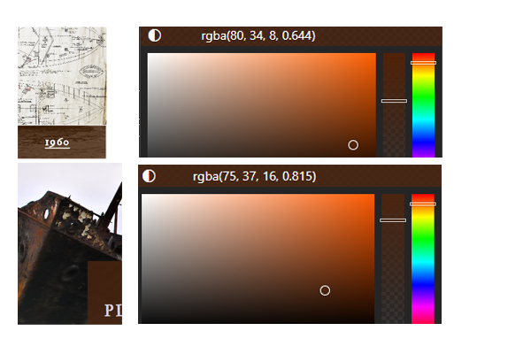

Initially I wanted to incorporate the idea of an historical timeline using skewed and staggered pictures with basic information below and above each year. However I wasn't able to impletent this in testing to allow for different screen sizes so I abandoned the idea in favour of a simpler layout based on and incorporating some of the code from the Love Running project. I may revisit this idea after I gain more experience and skills in web development. <a href="https://codepen.io/brianach/pen/eYjZgYm" target="blank">Code Snippet</a>

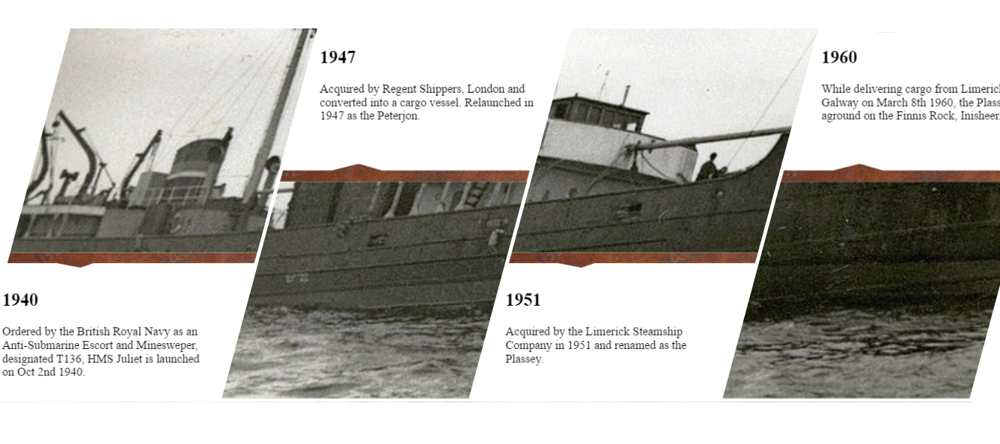

 

### <h2>Fonts</h2> 

I chose IM Fell for the Title and Menu and Lora for the body. I chose IM Fell as I wanted something with an antique flavour to it and I chose Lora as it was a good comlimentary font. IM Fell was also a good match for the Plassy prefix.

 

### <h2>Structure</h2> 

I stayed with a basic clean look and feel, again taking design cues from the Love Running project. The interface is clear and simple but in addition the sub pages which can only be accessed via the history page is highly intuitive. In fact the first person I asked to have a look immediately went to that timeline link bar without my having to point out that it was a navigation bar. 

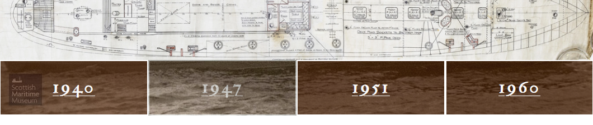

I chose not to turn the timeline at the bottom of the home page into a navigation bar because it would prevent the visitor from going to the history page first. This page is the starting off point for the history journey and the visitor might miss out on this central point of the journey if the timeline were used to link to other pages.

 

### <h2>Features</h2> 

 * Navigation Bar
 * Timeline
 * Social Media Footer
 * Timeline Navigation Bar
 * Feedback form

 

### <h2>Wireframes</h2> 

Home
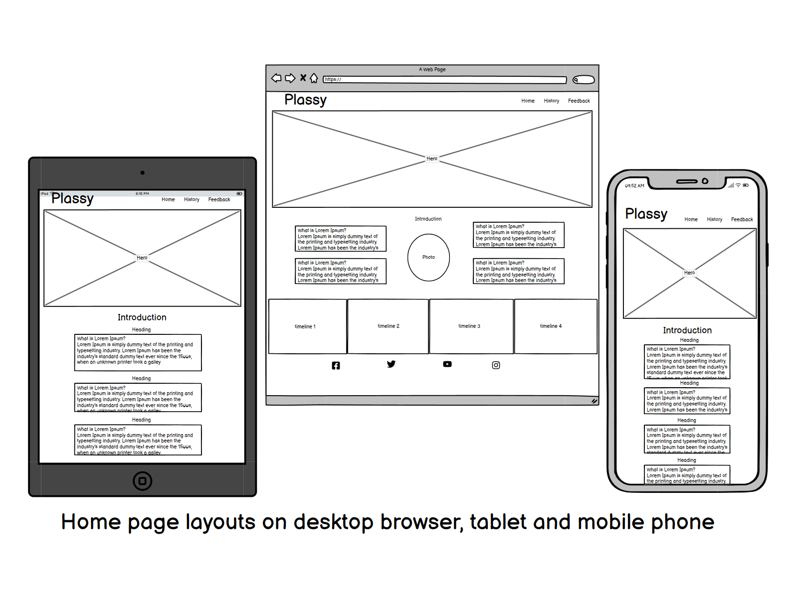

History

Feedback
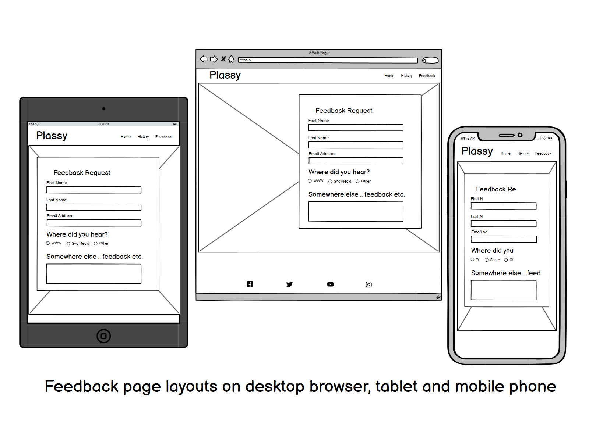

 

### <h2>Languages and Technologies</h2> 

[Balsamiq](https://balsamiq.com/) was used to create the wireframes

[Google Fonts](https://fonts.google.com) was used for the fonts IM Fell and Lora.

[Fontawesome](https://fontawesome.com) was used for the social media icons

[Navionocs](https://www.navionics.com/gbr/charts/) was used to create a coastal chart

[Photoshop](https://sdobe.com) was used to manipulate images

[HTML](https://en.wikipedia.org/wiki/HTML) HTML for the text content and some media

[CSS](https://en.wikipedia.org/wiki/CSS) CSS for the design and some media

[WAVE](https://wave.webaim.org/) WAVE Web Accessibility Evaluation

 
 

## <h1>Testing</h1> 

 

### <h2>Accessibility</h2>

No errors were found running the website through the WAVE Accessibility Checker website. 

Redundant (self reffering menu) links were removed from the three main pages where the relative page is the active page. This doesn't stop the warning being generated on some WAVE reports.

Home
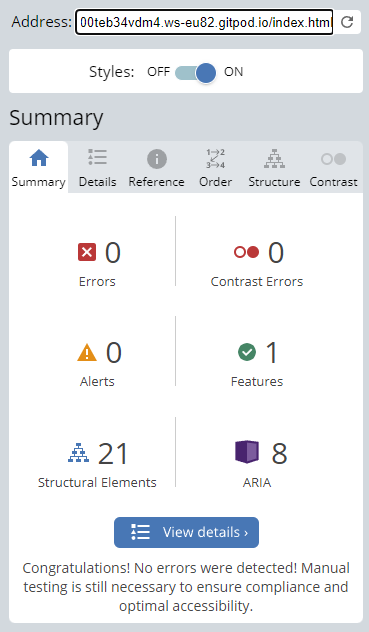

History
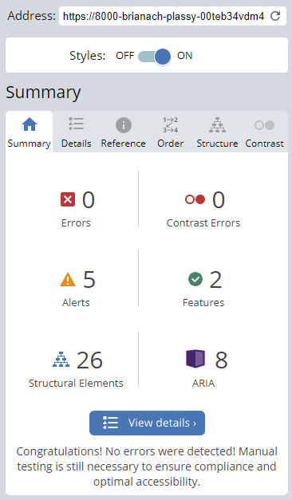

History-1940
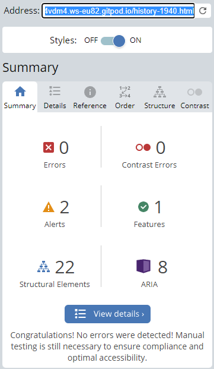

History-1947

History-1951
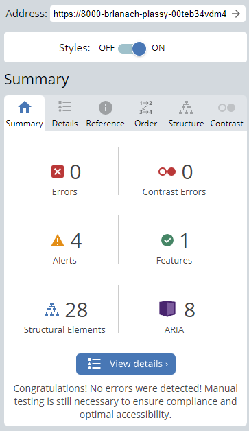

History-1960
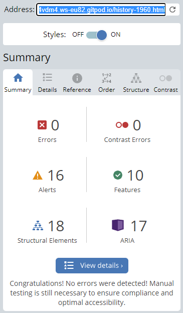

Feedback
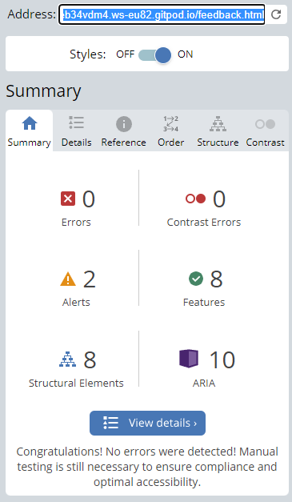

 

### <h2>Performance</h2> 

I used developer tools in Chrome and Firefox during development in order to continuouly gauge performance and responsiveness. The following hardware was used to test real life performance.

#### Devices Used

* Desktop PC  
* Macbook Pro
* Macbook Air
* Lenovo Yoga
* Huawei P20 
* iPhone

I tested the site using various browsers on the differnet devices.

#### Browsers Used

* Microsoft Edge
* Safari
* Google Chrome
* Mozilla Firefox
* Opera
 

### <h2>Validation</h2> 

*  [HTML Validator](https://validator.w3.org/) was used throughout the project to test for errors. 

    History-1960.html generated an iframe error where I put some youtube content at the bottom of the page. This will be addressed in CSS in a future enhancement.

    A number of pages generated warning where sections do not have any heading. Presentation or performance is not impacted on any device and will be addressed in a future enhancement.

* [CSS Validator](https://validator.w3.org/) used to check for and correct errors. There are currently no errors in the code as currently submitted.

 

### <h2>Responsiveness</h2> 

* [Lighthouse](https://developer.chrome.com/en/docs/lighthouse/) in Chrome Developer Tools was used to check performance. 

  

Home
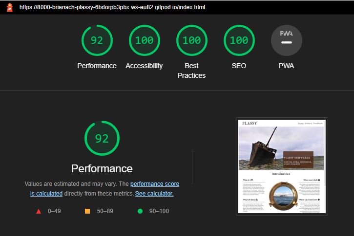

  

History

      Performance was improved here by reducing the size of the main graphic and setting explit width and size on image elements. See difference beteen history-1 and history-2 pictures.

  

History performance after tweak
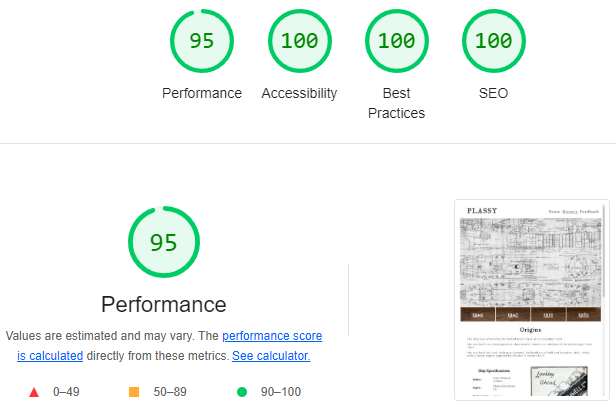

    

History-1940
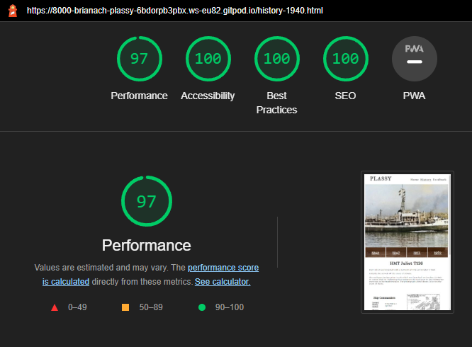

    

History-1947
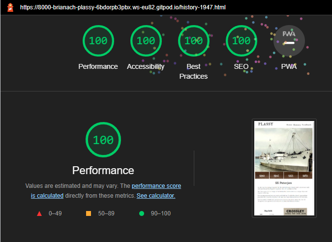

    

History-1951
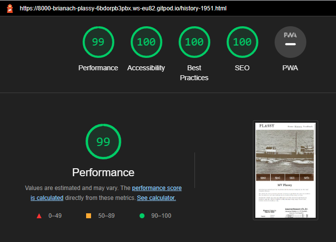

    

History-1960
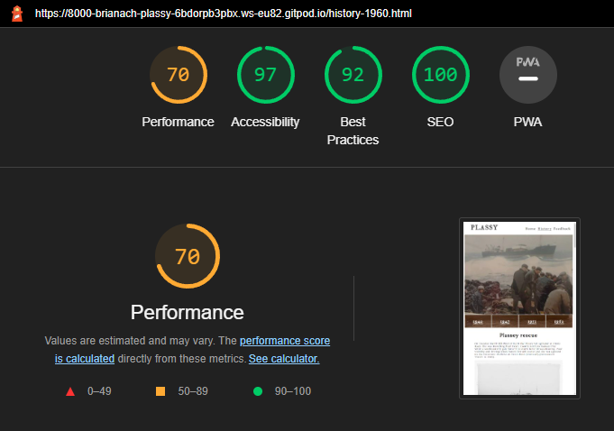

      This page has a large amount of images to support the information on the page. Performance was improved here by reducing the size of the images and setting explit width and size on all image elements. See before image above and result below.
    

History-1960 performance after tweak
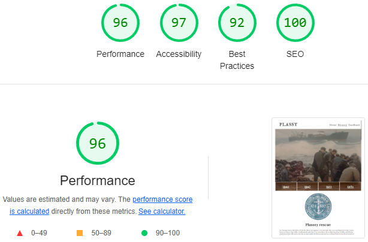
   

  

Feedback
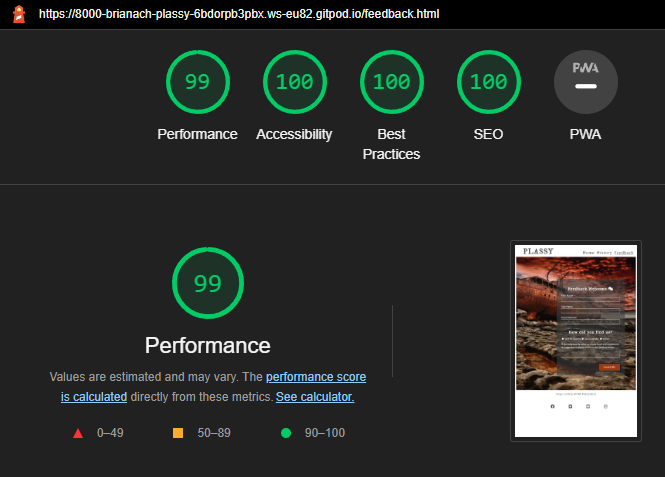

 
 

## <h1>User Story Testing</h1> 

I tested the user story as follows.

### <h2>As a visitor I want to get information about the Plassy</h2>

The homepage provides a quick overview with intuite and easy to acces links to further information.

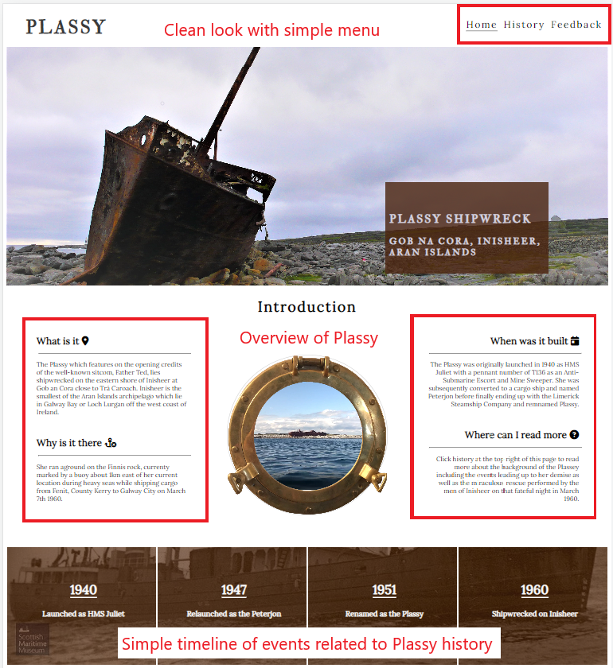

The history page starts with the origins of the Plassy and presents a clickable timeline to bring the visitor deeper into the story. Each link on the timeline menubar presents a page of information related to the year selected and follows the same page style but substituting the main (hero) image with one which is relevant to the historical information presented.

The final feedback page provides the user with an opportunity to react to the site giving them the ability to submit some basic feedback, commentary or request for further information if they so wish.

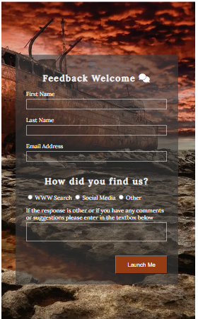

All pages were tested with the visitor in mind in terms of accessiblity, presentation, responsiveness and performance. All links were tested to ensure functionality. Below is a simpe chart of the results.

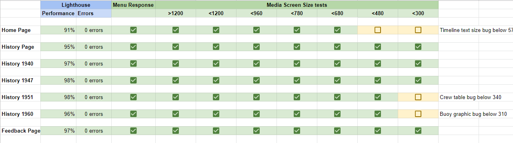

 

## <h1>Acknowledgements</h1>

Thanks to the following people who have supported me:

  + My mentor Gaff (Naoise Gaffney)
  + Cohort team lead Jonny Davison
  + My wife Tricia
  + All the slackers on Code Institue
  + LWETB and Code Institute for the opportunity to do this

 

## <h1>Credits</h1>

### <h2>Origins References (History)</h2>

  + <h3><a href="https://www.wrecksite.eu/ownerBuilderView.aspx?533" target="_blank">[Photograph of Cook, Welton & Gemmel shipyard]()</a></h3>
  + <h3><a href="https://en.wikipedia.org/wiki/Cook,_Welton_%26_Gemmell" target="_blank">Wikipedia entry for Cook, Welton & Gemmel</a></h3>
  + <h3><a href="https://www.shipsnostalgia.com/media/hms-juliet.38115/" target="_blank">Ship specifications for HMT Juliet</a></h3>
  + <h3><a href="https://www.gracesguide.co.uk/Cook,_Welton_and_Gemmell" target="_blank">Cook, Welton & Gemmel entry on Grace's Guide</a></h3>

     

### <h2>Juliet References (1940) </h2>

  + <h3><a href="https://uboat.net/allies/warships/ship/6599.html" target="_blank">HMT Juliet Commanders</a></h3>
  + <h3><a href="https://en.wikipedia.org/wiki/Operation_Torch" target="_blank">Wikipedia entry for Operation Torch</a></h3>
  + <h3><a href="https://www.shipsnostalgia.com/media/hms-juliet.38115/" target="_blank">Photograph of HMS Juliet</a></h3>

  

### <h2>Peterjon References (1947)</h2>

  + <h3><a href="https://www.shipsnostalgia.com/media/peterjon.32520/" target="_blank">Photograph of Peterjon ready to sail</a></h3>
  + <h3><a href="https://www.shipsnostalgia.com/media/h-m-s-juliet.24578/" target="_blank">Waiting conversion photograph</a></h3>
  + <h3><a href="https://www.shipsnostalgia.com/media/plassy.230865/" target="_blank">Almost complete photograph</a></h3>
  + <h3><a href="https://www.shipsnostalgia.com/media/j-s-doigs-no-1-fitting-shop.105137/" target="_blank">JS Doig's Shipyards</a></h3>
  + <h3><a href="https://www.gracesguide.co.uk/Crossley_Brothers" target="_blank">Crossley Brothers entry on Graces Guide</a></h3>
  + <h3><a href="https://en.wikipedia.org/wiki/Crossley" target="_blank">Wikipedia entry for Crossley</a></h3>
  + <h3><a href="https://lifeboatmagazinearchive.rnli.org/volume/32/349/services-of-the-life-boats-of-the-institution-during-1948?searchterm=Yacht+Gan&page=194" target="_blank">RNLI Archive page</a></h3>
  + <h3><a href="https://rnliarchive.blob.core.windows.net/media/1350/0349.pdf#page=34" target="_blank">Pages 12 & 40 RNLI Archive featuring SS Peterjon</a></h3>

 

### <h2>Plassy References (1951)</h2>

  + <h3><a href="https://www.flickr.com/photos/scottishmaritimemuseum/15651974933" target="_blank">The Plassy at sea from Scottish Maritime Museum on Flickr</a></h3>
  + <h3><a href="https://www.navionics.com/gbr/charts/" target="_blank"> Navionics online nautical charts</a></h3>
  
 

### <h2>Rescue References</h2>

+ <h3><a href="https://www.facebook.com/211241455563057/photos/pb.100064625141906.-2207520000./881297881890741/?type=3" target="_blank">Main photograph</a></h3>
+ <h3> Photograph of Onshore Rescue Unit logo on the doors of 'Teachín an Rocket', Inisheer. Ronán McCall 2003.

+ <h3>List of photographs of the Plassy from private collection</h3>

      Plassy on Finnis rock after rescue

      Onshore Rescue Unit arrives

      Rescue unit assembling 'Rocket'

      Final attempt at rcoket firing

      Unit preparing to pull

      Final crew member ashore

      Plassy lifeboat on rocks

+  <h3><a href="https://www.geograph.org.uk/gridref/L9901?user=15801" target="_blank">From Harold Strong photography on Geograph</a></h3>

        Onshore Rescue Unit on exercise 1962

        Plassy on the rocks port side

        Plassy on the rocks starboard side

        Anchors in the foreground

        Plassy bridge looking astern

+ <h3><a href="https://youtu.be/ca9_nFfjYgs" target="_blank">Video by Nuno Charneca from the Portuguese National Civil Engineering Laboratory for the drone footage. This video was made as part of a drone demo during Citizen Science + GIS Training School @ NUI Galway organized by Seán Lynch, NUIG Geography Society and funded by COST (cost.eu). 22 Aug 2015.</a></h3>
