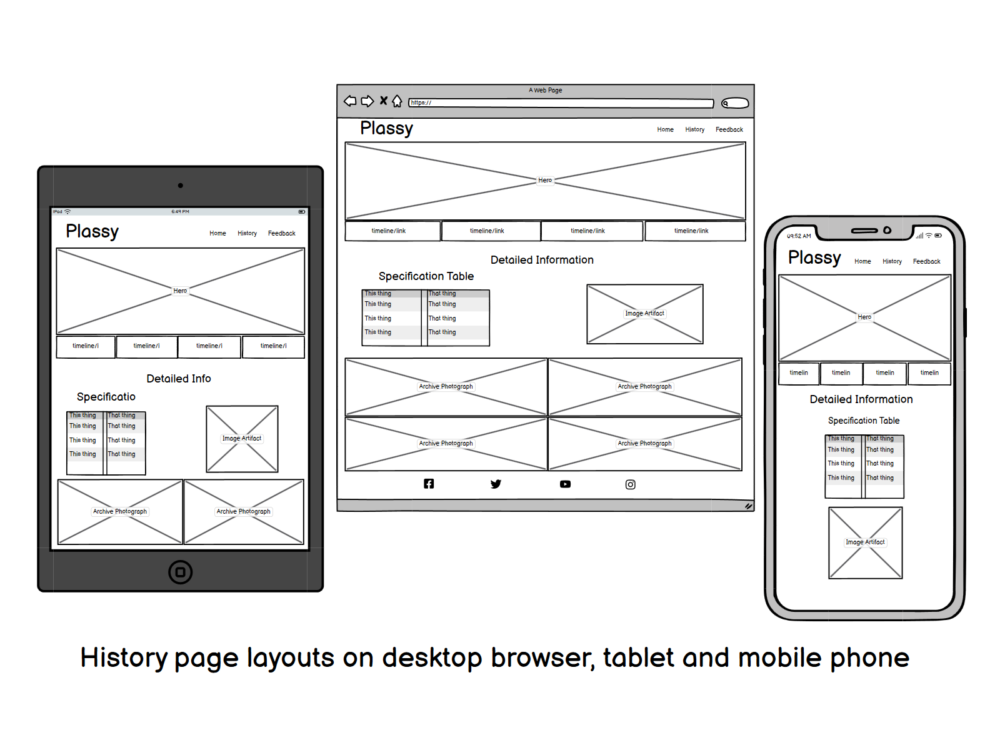

# Plassy

## Table of Contents

- [Plassy](#milestonoe-1-project--plassy)
- [Introduction](#introcuction)
- [Goals](#goals)
- [Design and Planning](design-and-planning)
- [Features](#features)
- [Language and Technologies](#language-and-technologies)
- [Testing](#testing)

1. [Introduction](#introduction)
  1.[Who am I?](#who-am-i)
  2.[Why the Plassy?](#why-the-plassy)
2. [Goals](#goals)
  1.[Personal Goals](#personal-goals)
  2.[User Goals](#user-goals)
3. [Design and Planning](#design-and-planning)
  1.[Wireframes](#wireframes)
  2.[]

## Introduction

### Who am I?

My name is Brían ó Cualáin and I am a native of Inisheer which is the smallest of the Aran Islands archipelago off the west coast of Ireland although I have been living in Ireland for the last 30 years. (Us islanders refer to the mainland as Ireland like someone might refer to it as another country which culturally and linguistically if not indeed physically it almost is.) Inisheer's population has remained around the 300 mark since I grew up there and it continues to be an ever more popular tourist destination endowned as it is by both natural and manmade beauty and its location beside the world renowned Cliffs of Moher, Doolin, Lahinch and the Aran Islands themselves.

### Why the Plassy?

I have been fascinated with the Plassy since I was a child. It was a favouite spot in which to play hide and seek or just to explore from the time I first managed to climb up into it, itself a rite of passage of sorts when growing up on Inisheer. One of my scariest and proudest moments was walking accross the 4m iron girder in the engine room in order to climb down there to explore the dark recesses of the ship. The girder was barely 10cm wide and there was a drop of about 4m to the engine room floor which was strewn with debris and rusting metal, hence the mix of fear and pride. Of course it goes withouot saying that I wouldn't encourage anyone to do such a thing today and in fact it is even more dangerous than ever now given the state of corrosion of the plassy and the advanced structural damage caused over time by the incessant pounding of Atlantic storms.

## Goals

### Personal Goals

- Record knowledge
- Add to knowledge
- Learn to create attractive web pages
- Build a portfolio of webpages
- Gain employment or create a solo web development business

Its my intention to add further to the Plassy in terms of information and enhancement and to broade its scope to related maritime and historical topics. Future enhancement would also include accomadation and travel information. 

### User Goals

 - Learn about the Plassy
 - Learn about shipbuilding
 - Discover its fascinating history
 - Appreciate the human aspect
 - Add visiting the Plassy to bucket list

## Design and Planning

The website is designed inspire curiousity, nostalgia and adventure.

### Color

I chose a sepia inspired color scheme but also one that is in harmony with the subject in terms of tone and feel. I chose the colors manually without using any online resources as I have a background in art and design, having studied in art college and working as an artist and sign maker in my twenties.

Initially I wanted to incorporate the idea of a historical timeline using skewed and staggered pictures with basic information below and above each year. However I wasn't able to impletent this in testing to allow for different screen sizes so I abandoned the idea in favour of a simpler layout based on and incorporating some of the code from the Love Running project. I may revisit this idea after I gain more experience and skills in web development. <a href="https://codepen.io/brianach/pen/eYjZgYm" target="blank">Code Snippet</a>

### Wireframes

Home

History

Feedback

### Fonts

I chose IM Fell for the Title and Menu and Lora for the body. I chose IM Feel as I wanted something with an antique flavour to it and Lora as it was a good comlimentary font.

### Features

### Languages and Technologies

## Testing

### Validation

### Responsiveness

## User Story Testing

[def]: https

