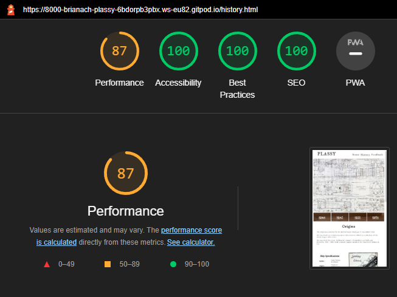

# <h1>Plassy</h1>

 

 

## <h1>Table of Contents</h1>

 

- [Plassy](#plassy)
- [Introduction](#introduction)
  + [Who am I?](#who-am-i)
  + [Why the Plassy?](#why-the-plassy)
- [Goals](#goals)
  + [Personal Goals](#personal-goals)
  + [Visitor Goals](#visitor-goals)
- [Design and Planning](#design-and-planning)
  + [Color](#color)
  + [Fonts](#fonts)
  + [Structure](#structure)
  + [Features](#features)
  + [Wireframes](#wireframes)
  + [Languages and Technologies](#languages-and-technologies)
- [Testing](#testing)
  + [Performance](#performance)
  + [Validation](#validation)
  + [Reponsiveness](#responsiveness)

 
 

## <h1>Introduction</h1> 

### <h2>Who am I?</h2> 

My name is Brían ó Cualáin and I am a native of Inisheer which is the smallest of the Aran Islands archipelago off the west coast of Ireland although I have been living in Ireland for the last 30 years. ( We islanders refer to the mainland as Ireland like someone might refer to it as another country which culturally and linguistically if not indeed physically it almost is. 😉) Inisheer's population has remained around the 300 mark since I grew up there and it continues to be an ever more popular tourist destination endowned as it is by both natural and manmade beauty and its location beside the world renowned Cliffs of Moher, Doolin, Lahinch and the Aran Islands themselves.

### <h2>Why the Plassy?</h2> 

I have been fascinated with the Plassy since I was a child. It was a favouite spot in which to play hide and seek or just to explore from the time I first managed to climb up into it, itself a rite of passage of sorts when growing up on Inisheer. One of my scariest and proudest moments was walking accross the 4m iron girder in the engine room in order to climb down there to explore the dark recesses of the ship. The girder was barely 10cm wide and there was a drop of about 4m to the engine room floor which was strewn with debris and rusting metal, hence the mix of fear and pride. Of course it goes withouot saying that I wouldn't encourage anyone to do such a thing today and in fact it is even more dangerous than ever now given the state of corrosion of the plassy and the advanced structural damage caused over time by the incessant pounding of Atlantic storms.

 
 

## <h1>Goals</h1> 

### <h2>Personal Goals</h2>

 

- Record knowledge
- Add to knowledge
- Learn to create attractive web pages
- Build a portfolio of webpages
- Gain employment or create a solo web development business

Its my intention to add further to the Plassy in terms of information and enhancement and to broade its scope to related maritime and historical topics. Future enhancement would also include accomadation and travel information. 

 

### <h2>Visitor Goals</h2>

 

 - Learn about the Plassy
 - Learn about shipbuilding
 - Discover its fascinating history
 - Appreciate the human aspect
 - Add visiting the Plassy to bucket list

 
 

## <h1>Design and Planning</h1> 

The website is designed inspire curiousity, nostalgia and adventure. It is designed as three main pages but features a center page that takes the visitor into a more engaging experience with the subject by the use of four pages that give more information in realtion to the specific timepoints in the chronology.

 

### <h2>Color</h2> 

I chose a sepia inspired color scheme but also one that is in harmony with the subject in terms of tone and feel. The colors and transparent text backgrounds are closely matched to the rust tones in the subject matter.

Initially I wanted to incorporate the idea of a historical timeline using skewed and staggered pictures with basic information below and above each year. However I wasn't able to impletent this in testing to allow for different screen sizes so I abandoned the idea in favour of a simpler layout based on and incorporating some of the code from the Love Running project. I may revisit this idea after I gain more experience and skills in web development. <a href="https://codepen.io/brianach/pen/eYjZgYm" target="blank">Code Snippet</a>

 

### <h2>Fonts</h2> 

I chose IM Fell for the Title and Menu and Lora for the body. I chose IM Feel as I wanted something with an antique flavour to it and Lora as it was a good comlimentary font. IM Fell was also a good match for the Plassy prefix.

 

### <h2>Structure</h2> 

I stayed with a basic clean look and feel again taking design cues from the Love Running project. The interface is clear and simple but in addition the sub pages which can only be accessed via the history page is exteremly intuitive. In fact the first person I asked to have a look immediately went to that timeline link bar without my having to point out that it was a link bar. 

I chose not to turn the timeline at the bottom of the home page into a link bar because it would prevent the visitor from going to the history page first. This page is the starting off page for the history journey and it would be wrong to have the visitor go to the timeline pages prior to that.

 

### <h2>Features</h2> 

 * Navigation Bar
 * Timeline
 * Social Media Footer
 * Timeline Linkbar

 

### <h2>Wireframes</h2> 

Home

History

Feedback

 

### <h2>Languages and Technologies</h2> 

[Balsamiq](https://balsamiq.com/) was used to create the wireframes

[Google Fonts](https://fonts.google.com) was used for the fonts IM Fell and Lora.

[Fontawesome](https://fontawesome.com) was used for the social media icons

[Navionocs](https://www.navionics.com/gbr/charts/) was used to create a coastal chart

[Photoshop](https://sdobe.com) was used to manipulate images

[HTML](https://en.wikipedia.org/wiki/HTML) HTML for the text content and some media

[CSS](https://en.wikipedia.org/wiki/CSS) CSS for the design and some media

 
 

## <h1>Testing</h1> 

 

### <h2>Performance</h2> 

I used developer tools in Chrome and Firefox during development in order to continuouly gauge performance and responsiveness. The following hardware was used to test real life performace.

#### Devices Used

* Desktop PC  
* Macbook Pro
* Macbook Air
* Lenovo Yoga
* Huawei P20 
* iPhone

I tested the site using various browsers on the differnet devices.

#### Browsers Used

* Microsoft Edge
* Safari
* Google Chrome
* Mozilla Firefox
* Opera
 

### <h2>Validation</h2> 

*  [HTML Validator](https://validator.w3.org/) was used throughout the project to test for errors. Somepages exhibit errors but the presentation and performace of the pages are not affected and have been tested on various browsers and platforms without issue. The browsers and platforms are Chrome, Firefox, Opera, Safari, Android, iOS. 

    The pages with the errors are as follows: history.html history-1960.html. The errors are due to using inline styling for images which were not rendering correctly at the point of submission and will be address in CSS in a future enhancement. In addtion history-1960.html generated an iframe error where I put some youtube content at the bottom of the page. This will also be address in CSS in a future enhancement.

    Finally a number of pages generated warning where sections do not have any heading. Again presentation or performace not impacted and errors will be address in a future enhancement.

* [CSS Validator](https://validator.w3.org/) used to check for and correct errors. There are currently no errors in the code as submitted.

 

### <h2>Responsiveness</h2> 

* [Lighthouse](https://developer.chrome.com/en/docs/lighthouse/) in Chrome Developer Tools was used to check performance. 

  

Home

  

History

      Performance will be improved here by reducing the size of the main graphic and setting explit width and size on image elements.

    

History-1940

    

History-1947

    

History-1951

    

History-1960

      This page has a large amount of images to support the information on the page. Performance will be improved here by reducing the size of the images and setting explit width and size on all image elements. 

  

Feedback

 
 

## <h1>User Story Testing</h1> 

